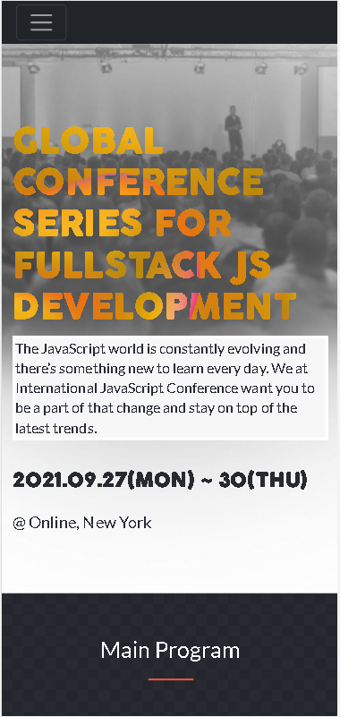

 [](https://hits.seeyoufarm.com)

# iJS Conference Project

> This is my Module 1 Capstone Project for Microverse

## Built With

- HTML
- CSS
- Javascript
- Bootstrap

## Preview



## Live Demo

[Live Demo Link](https://lfmnovaes.github.io/conference/)

## Getting Started

- Run git clone on this project at the desired directory:
   ```
   git clone https://github.com/lfmnovaes/conference.git
   ```
- Open the index.html in your favorite browser
- Right-click on the website and go to Inspect (Google Chrome) or Inspect Element (Firefox)

### Prerequisites

An updated web browser

### Usage

- Open the website with any Browser (preferably with Google Chrome)
- Scroll down to see different sections of the page

## Authors

👤 **Luís Fernando**

- GitHub: [](https://github.com/lfmnovaes)
- Twitter: [](https://www.twitter.com/lfmnovaes/)
- LinkedIn: [](https://www.linkedin.com/in/lfmnovaes/)

## 🤝 Contributing

Contributions, issues, and feature requests are welcome!

Feel free to check the [issues page](../../issues/).

## Show your support

Give a ⭐️ if you like this project!

## Acknowledgments

To everyone in Microverse.

## 📝 License

This project is [MIT](./LICENSE) licensed.

Original design idea by [Cindy Shin](https://www.behance.net/adagio07) in Behance is licensed under a
[Creative Commons Attribution-NonCommercial-ShareAlike 4.0 International License][cc-by-nc-sa].

[![CC BY-NC-SA 4.0][cc-by-nc-sa-image]][cc-by-nc-sa]

[cc-by-nc-sa]: http://creativecommons.org/licenses/by-nc-sa/4.0/
[cc-by-nc-sa-image]: https://licensebuttons.net/l/by-nc-sa/4.0/88x31.png
[cc-by-nc-sa-shield]: https://img.shields.io/badge/License-CC%20BY--NC--SA%204.0-lightgrey.svg

Event images and logo taken from [iJS 2021](https://javascript-conference.com/).

Main program icons by [svgrepo.com](https://www.svgrepo.com/)
